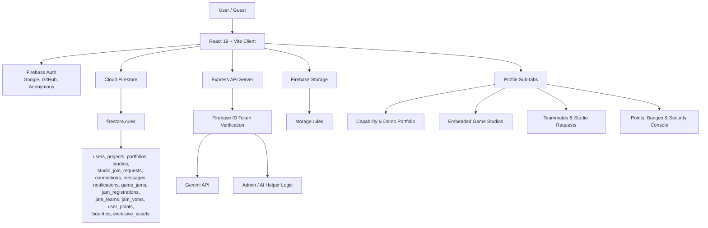

# IndieCollab

IndieCollab is a Firebase-backed collaboration hub for solo and indie game developers. It combines project recruiting, teammate discovery, studio management, game jams, portfolio evidence, bug bounties, asset trading, chat, notifications, and AI-assisted writing in one React application.

## Core Features

- Projects: publish collaboration opportunities, manage demo media, meet links, and project task progress.
- Teammates: browse developer profiles, send/approve connection requests, and start quick meeting rooms.
- Profile: maintain the personal capability card, portfolio evidence, connected teammates, studio requests, points, badges, and security console.
- Game Studios: create long-term studios, request to join, owner-approve members, leave safely, and run studio game jams.
- Game Jams: create jams, register solo/team entries, vote, track rankings, and award points/badges.
- Market: bounty workflow for bug fixing and exclusive asset sales backed by Firebase Storage rules.
- AI: Express API endpoints for pitch/bio assistance, protected by Firebase ID tokens.

## System Architecture



## Firebase Model

Firestore is the source of truth. There is no local JSON fallback for app data writes.

| Collection | Primary Owner / Access Model |
| --- | --- |
| `users` | User can create/update/delete only their own UID document. Public read. |
| `projects` | Owner-only create/update/delete. Public read. |
| `portfolios` | User owns their portfolio items. Optional `category` marks demo, art, certificate, degree, audio, or video. |
| `studios` | Owner controls studio document. Members can only remove their own `memberIds`/`members` entry when leaving. |
| `studio_join_requests` | Requester creates pending request; studio owner accepts/declines. |
| `connections` | Sender/receiver can read; receiver accepts/declines; either side can delete. |
| `messages` | Participants only. Sender creates messages; participants can mark read. |
| `notifications` | Notification owner can read/update/delete. |
| `game_jams` | Organizer creates/updates/deletes; public read. |
| `jam_registrations`, `jam_teams`, `jam_votes`, `user_points` | Authenticated, scoped rules for registrations, teams, voting, and append-only points. |
| `bounties`, `exclusive_assets` | Owner/assignee/buyer workflows enforced in rules. |

## Studio Join / Leave Flow

1. Studio creation writes both `members: [displayName]` and `memberIds: [auth.uid]`.
2. A non-member clicks join and creates a `studio_join_requests` document. The client does not directly mutate `/studios/{studioId}`.
3. The studio owner accepts the request. Owner permissions update both `members` and `memberIds`.
4. A member leaving updates only `members` and `memberIds`, removes exactly one entry, and preserves all core studio fields.
5. Existing old studios without `memberIds` should be backfilled before relying on member self-leave.

Backfill dry run:

```bash
npm run firebase:backfill-studio-members
```

Backfill production write, after adding `service-account.json` in the project root:

```bash
node scripts/backfill-studio-memberIds.js --write
```

## Firebase CLI Checks

The repo uses local `firebase-tools`, so commands work even when `firebase` is not installed globally:

```bash
node node_modules/firebase-tools/lib/bin/firebase.js --version
node node_modules/firebase-tools/lib/bin/firebase.js use
node node_modules/firebase-tools/lib/bin/firebase.js deploy --only firestore:rules,firestore:indexes --dry-run
```

Current Firebase project:

```text
indiecollab-944a1
```

## Local Development

Install dependencies:

```bash
npm install
```

Create `.env`:

```env
GEMINI_API_KEY=your_gemini_api_key_here
PORT=3000
```

Run dev server:

```bash
npm run dev
```

Type-check:

```bash
npm run lint
```

Build:

```bash
npm run build
```

Start production build:

```bash
npm start
```

## Deployment Notes

- `firebase.json` deploys Hosting from `dist`, Firestore rules/indexes, and Storage rules.
- Build before hosting deploy so `dist/` contains the latest Vite client and bundled Express server.
- Use Firebase dry-run for rules/index validation before deploying rule changes.
- Firebase Storage must be initialized in the Firebase Console before `firebase deploy --only storage --dry-run` or Storage rules deploy can succeed.
- Keep `service-account.json` out of git. It is only needed for admin migration scripts such as studio `memberIds` backfill.

## Security Notes

- Guest mode uses Firebase Anonymous Auth and keeps the anonymous session across guest logout to preserve UID-linked data.
- The intro video is hidden after the user closes it by setting `indiecollab_hide_intro` in local storage.
- Backend API calls must use Firebase ID tokens; fake identity headers are not trusted.
- Firestore rules enforce ownership, immutable workflow fields, append-only ledgers, and narrow diff checks where possible.
- Storage rules should be deployed together with Firestore rules for asset access consistency.
