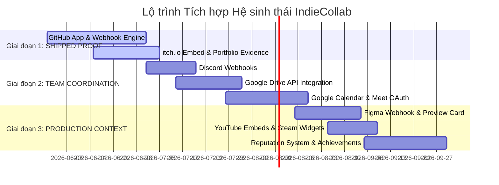
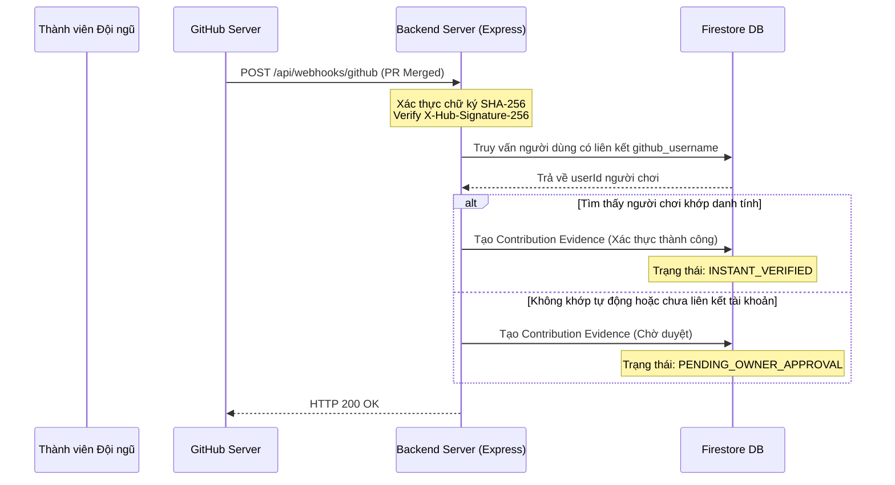

# TÀI LIỆU THIẾT KẾ KIẾN TRÚC & LỘ TRÌNH TÍCH HỢP HỆ SINH THÁI INDIECOLLAB

## 1. Executive Summary (Tóm tắt dự án)
Tài liệu này xác lập thiết kế hệ thống chi tiết và lộ trình phát hành tích hợp bên thứ ba cho **IndieCollab** qua 3 giai đoạn nhằm đảm bảo mục tiêu: **Kiểm chứng đóng đóng góp thực tế, nâng cao năng suất hoạt động của các nhóm indie và xây dựng hồ sơ năng lực đáng tin cậy**. 

Bằng cách tích hợp chặt chẽ với GitHub, itch.io, Discord, Google Workspace, Figma, YouTube và Steam, IndieCollab không tìm cách thay thế các công cụ hiện quả mà định vị mình là **hạt nhân hợp nhất trải nghiệm**, xâu chuỗi dữ liệu rải rác từ quá trình phát triển game thành một câu chuyện sản phẩm và năng lực rõ ràng, có bằng chứng xác minh.

---

## 2. Current Product Baseline (Đánh giá hiện trạng ứng dụng)
Ứng dụng hiện tại là một sản phẩm Full-Stack áp dụng mô hình:
- **Frontend**: React 19 + Vite + Tailwind CSS v4, sử dụng `lucide-react` để hiển thị icon đồng bộ và thư viện `motion` từ `motion/react` để dựng animation.
- **Backend/Middleman**: Express Server v4 chạy trên port 3000 thông qua lớp `server.ts` và được biên dịch sang CJS qua esbuild để phục vụ cả môi trường Dev và Production.
- **Database**: Firebase Client & Admin SDK tương tác trực tiếp với Google Firestore.
- **Xác thực**: Firebase Authentication (hỗ trợ Google Login, OAuth Flow popup-based ngoài Iframe và Email/Guest).
- **GitHub Linkage (Cơ bản)**: Hiện tại, tính năng liên kết repository và Kanban Workspace ở mức thô sơ (lưu URL thủ công, thiếu cơ chế xác minh tự động từ Webhooks).

---

## 3. Product Principles and Non-Goals (Nguyên tắc sản phẩm & Giới hạn)
### Nguyên tắc thiết kế cốt lõi
1. **Kiểm chứng đóng góp (Evidence over Claims)**: Mọi đóng góp ghi trên portfolio của cá nhân phải được liên kết trực tiếp với bằng chứng (PR merged trên GitHub, dự án itch.io thực tế, milestone hoàn tất).
2. **Bảo mật tuyệt đối thông tin nhạy cảm (Zero-Trust Token Policy)**: Token OAuth, Webhook secret của studio lưu trữ an toàn phía backend, được mã hóa bằng AES-256 trong Firestore hoặc nạp qua Secret Manager. Không bao giờ lưu ở Client-readable document.
3. **Trải nghiệm mượt mà đa trạng thái (Exceptional Resiliency UI)**: Mọi màn hình tích hợp phải thiết kế đầy đủ các trạng thái: *Loading*, *Empty*, *Error*, *Disconnected*, *Unauthorized*, và tự động chuyển đổi giao diện khi quyền truy cập bị ngắt kết nối/thu hồi (*Revoked*).
4. **Việt hóa chuẩn mực**: Toàn bộ ngôn ngữ hiển thị trên giao diện liên quan đến hệ thống phải là tiếng Việt chuẩn mực, có dấu nguyên bản đầy đủ, từ ngữ kỹ thuật được dịch nghĩa tự nhiên.

### Mục tiêu không theo đuổi (Non-Goals)
*   Không xây dựng trình chia sẻ mã nguồn thay thế GitHub.
*   Không xây dựng cổng thanh toán/bán hàng điện tử thay thế itch.io hay Steam.
*   Không xây hệ thống chat nội bộ thay thế hoàn toàn Discord; chỉ đóng vai trò đẩy thông báo sự kiện quan trọng.
*   Không tự phát triển nền tảng họp trực tuyến; ủy quyền toàn bộ cho Google Meet thông qua Calendar Event API.

---

## 4. Three-Phase Roadmap (Lộ trình 3 Giai đoạn)



---

## 5. Integration-by-Integration Design (Thiết kế chi tiết từng Tích hợp)

### 5.1 GIAI ĐOẠN 1: SHIPPED PROOF (Minh chứng đóng góp thực tế)

#### A. GitHub App + Webhook Engine
*   **Mô hình tương tác**: Thay vì sử dụng Personal Access Token (PAT) của từng cá nhân rất khó quản lý và rủi ro rò rỉ, IndieCollab sẽ triển khai một **GitHub App độc lập**.
*   **Luồng cài đặt**: Chủ sở hữu Workspace (Project Owner) sẽ nhấp chọn "Kết nối Repository", hệ thống backend tạo liên kết dẫn đến trang cài đặt của GitHub App. Người dùng cài đặt GitHub App lên repository của họ và cấp quyền (Pull Requests, Commits, Issues).
*   **Xử lý Webhook**: GitHub gửi các payload sự kiện về endpoint `/api/webhooks/github`. Server kiểm tra chữ ký SHA-256 (`X-Hub-Signature-256`) sử dụng Webhook Secret lưu trong cấu hình.
*   **Tạo Evidence (Bằng chứng đóng góp)**: Khi nhận sự kiện Pull Request `closed` và `merged === true`:
    1. Trích xuất thông tin người thực hiện PR (GitHub username).
    2. Đối chiếu GitHub username với hồ sơ tài khoản IndieCollab liên kết của các thành viên trong workspace.
    3. Tạo dữ liệu bằng chứng `contribution_evidence` với trạng thái `PENDING_VERIFICATION` nếu danh tính tự động match, hoặc chờ Owner phê duyệt thủ công nếu không tự động ánh xạ được để tránh hiện tượng spam.



#### B. itch.io SDK & Embed Integration
*   **Mô hình tương tác**: Sử dụng thẻ nhúng HTML và API công khai của itch.io để tích hợp sâu game build vào IndieCollab.
*   **Tải ứng dụng chơi thử**: Khi đăng tải game, studio cung cấp URL của game dạng `https://[username].itch.io/[game-name]`.
*   **Xây dựng Widget**:
    - Backend xác thực định dạng URL thông địa chỉ itch.io hợp lệ để phòng tránh lỗ hổng bảo mật XSS.
    - Trích xuất dự án và đính kèm thẻ nhúng `<iframe>` chính thức từ itch.io: `https://itch.io/embed/[game-id]?dark=true`.
*   **Bản đồ năng lực**: Cho phép gán game itch.io làm sản phẩm chính thức của Game Jam, hiển thị dưới dạng Carousel lộng lẫy và hỗ trợ chạy thử game tải trên nền Web trực tiếp ngay bên trong Showcase.

#### C. Portfolio Evidence Layer (Lớp Bằng chứng Năng lực)
*   **Cơ chế cốt lõi**: Mọi bằng chứng tích hợp được chuẩn hóa thành một tài liệu lưu trữ thống nhất.
*   **Cấu trúc dữ liệu**: Lưu trữ toàn bộ siêu dữ liệu (metadata) nguồn gốc như PR ID, Commit Hash, itch.io Game ID để người ngoài có thể click trực tiếp dẫn tới nguồn xác thực.
*   **Hạn chế rủi ro**: Chặn đứng tuyệt đối hành vi khai khống kinh nghiệm lập trình hoặc thiết kế game bằng cách gắn nhãn phân loại: "Verified" (Đã kiểm chứng bởi API nguồn) và "Manual" (Tự khai báo).

---

### 5.2 GIAI ĐOẠN 2: TEAM COORDINATION (Phối hợp đồng đội nhanh chóng)

#### A. Discord Webhook Integration
*   **Cơ chế hoạt động**: Project Owner dán Webhook URL của Discord Channel vào mục Settings của Project Workspace.
*   **Lưu trữ an toàn**: Backend mã hóa URL này bằng thuật toán AES-256 trước khi lưu vào Firestore. Khi có sự kiện phát sinh, backend giải mã và gửi payload định dạng Rich Embed sang Discord.
*   **Hạn chế Spam & Throttling**: Tích hợp cơ chế Queue ở bộ nhớ hoặc debounce (ví dụ: gộp nhiều tiến trình Git commit trong 5 phút vào 1 thông báo duy nhất).

#### B. Google Drive Picker Application
*   **Tích hợp UI**: Sử dụng Google Picker API (chạy trực tiếp ở client sau khi người dùng xác thực an toàn thông qua Google Client SDK).
*   **Ủy quyền tối thiểu**: IndieCollab chỉ yêu cầu scope xem siêu dữ liệu file được chọn `https://www.googleapis.com/auth/drive.metadata.readonly`, không yêu cầu quyền ghi hay sửa đổi tài liệu.
*   **Lưu trữ**: Lưu tên, kích thước file, định dạng MIME và đường dẫn xem trực tiếp để hỗ trợ mở file nhanh chóng trong thư mục tài liệu Workspace.

#### C. Google Calendar & Google Meet Core Integration
*   **Luồng OAuth & Sinh link**:
    - Khi tích hợp lịch họp, hệ thống kích hoạt OAuth Popup để người dùng cấp quyền `https://www.googleapis.com/auth/calendar.events`.
    - Khi tạo Lịch họp trong Workspace, backend gọi Google Calendar API để tạo Event, đặt `conferenceDataVersion` bằng `1` để Google tự động cấp link Google Meet chất lượng cao.
    - Cập nhật linh hoạt ID cuộc họp vào Workspace Chat Channel để toàn đội truy cập trực tiếp bằng một click.

---

### 5.3 GIAI ĐOẠN 3: CREATIVE PRODUCTION CONTEXT (Mở rộng ngữ cảnh sản xuất)

#### A. Figma Webhook Activity
*   **Cơ chế kết nối**: Lưu Figma Personal Access Token ở cấp độ Studio (nếu có dự án trả phí) hoặc OAuth làm cầu nối để lắng nghe Figma Webhooks khi có hoạt động cập nhật file (`file_updated`, `file_comment_added`).
*   **Lọc nhiễu**: Chỉ hiển thị hoạt động Figma lên Workspace Activity Feed khi có version mới được ghi chú rõ ràng bởi Artist hoặc Designer, tránh làm ngập thông báo lập trình viên.

#### B. YouTube Media Embeds
*   **Bảo mật & Responsive**: Trình phân lý phân tích link YouTube, hiển thị trình phát video có cấu hình đầy đủ tham số sandbox chặt chẽ, ngăn chặn chạy quảng cáo không mong muốn hoặc theo vết cookies người dùng từ bên thứ ba.

#### C. Steam Store Presence Card
*   **Liên kết dữ liệu**: Sử dụng API công khai của Steam Web API hoặc AppID Widget để tự động kéo thông tin Wishlist, Avatar game, và nút kêu gọi mua game về Trang chủ Studio chỉ bằng việc nhập Steam Game Id.

#### D. Verified Achievements & Reputation Engine
*   **Cơ chế điểm danh tiếng**: Tính điểm tin cậy dựa trên số lượng Contribution Evidence đã được hệ thống tự động xác minh. Điểm danh tiếng này sẽ tăng độ uy tín cho tài khoản của Solo Dev khi đi xin việc hoặc tuyển quân cho Game Jam tiếp theo.

---

## 6. Detailed Data Model (Mô hình dữ liệu chi tiết)

Nhằm tuân thủ nguyên tắc thiết kế của Firestore và bảo vệ dữ liệu nhạy cảm của người dùng, chúng ta đề xuất các Collection mới và cấu trúc cụ thể:

### 1. Collection `integration_connections` (Lưu thông tin kết nối cấp tài khoản)
*   **Mục đích**: Lưu thông tin OAuth token của người dùng (Google Calendar, Drive, GitHub).
*   **Quyền truy cập Security Rules**:
    - `@read`: Chỉ Chủ tài khoản được đọc (hoặc hệ thống backend).
    - `@write`: Chỉ Backend (Cloud Run) được ghi để cập nhật refresh_token. Client SDK bị cấm tuyệt đối tránh lộ API secrets.
*   **Vị trí**: `/integration_connections/{userId}`

```ts
interface IntegrationConnection {
  userId: string;
  github: {
    connected: boolean;
    username: string;
    accessTokenEncrypted?: string; // Mã hóaphía server bằng AES-256
    refreshTokenEncrypted?: string;
    tokenExpiresAt?: string;
  } | null;
  google: {
    connected: boolean;
    email: string;
    accessTokenEncrypted?: string;
    refreshTokenEncrypted?: string;
    tokenExpiresAt?: string;
    scopes: string[]; // ['drive.metadata.readonly', 'calendar.events']
  } | null;
  createdAt: string;
  updatedAt: string;
}
```

### 2. Collection `project_integrations` (Cấu hình tích hợp của Workspace)
*   **Mục đích**: Quản lý repository liên kết và Discord Webhooks của riêng từng Project.
*   **Quyền truy cập Security Rules**:
    - `@read`: Mọi thành viên được duyệt trong Project đều được đọc.
    - `@write`: Chỉ Admin hoặc Project Owner được phép cấu hình.
*   **Vị trí**: `/projects/{projectId}/settings/integrations`

```ts
interface ProjectIntegration {
  projectId: string;
  githubRepo: {
    owner: string;
    repoName: string;
    installationId: number; // GitHub App installation id
    linkedBranch: string; // ví dụ: 'main' hoặc 'master'
  } | null;
  discordWebhook: {
    enabled: boolean;
    webhookUrlEncrypted: string; // Mã hóa AES-256 phía backend
    eventsToNotify: string[]; // ['pr_merged', 'milestone_completed', 'jam_registered']
  } | null;
  updatedBy: string;
  updatedAt: string;
}
```

### 3. Collection `external_artifacts` (Tài nguyên nhúng ngoại vi)
*   **Mục đích**: Lưu trữ liên kết Figma, Google Drive docs hoặc YouTube Trailers đính kèm vào Task/Workspace.
*   **Quyền truy cập Security Rules**:
    - `@read`: Thành viên dự án được phép đọc.
    - `@write`: Thành viên dự án có quyền ghi.
*   **Vị trí**: `/projects/{projectId}/external_artifacts/{artifactId}`

```ts
interface ExternalArtifact {
  id: string;
  projectId: string;
  type: 'figma' | 'google_drive' | 'youtube' | 'itch_io' | 'steam';
  title: string;
  url: string;
  embedUrl?: string; // Dành cho itch.io hoặc Youtube phát trực tiếp
  mimeType?: string; // Ví dụ: sheet, document, folder đối với Drive
  attachedBy: string; // userId
  attachedAt: string;
  associatedTaskId?: string | null; // Có thể gắn trực tiếp vào một Task cụ thể
  metadata?: {
    fileSize?: string;
    lastUpdated?: string;
    thumbnailUrl?: string;
  };
}
```

### 4. Collection `contribution_evidence` (Bằng chứng năng lực của Thành viên)
*   **Mục đích**: Nơi kết tinh bằng chứng đóng góp phục vụ hiển thị trên Portfolio cá nhân.
*   **Quyền truy cập Security Rules**:
    - `@read`: Công khai (Mọi người đều được xem để công nhận hồ sơ năng lực).
    - `@write`: Chỉ Backend (Sự kiện Webhook xử lý) được quyền khởi tạo và ghi đè. Người dùng chỉ có quyền chỉnh sửa phần tự khai báo `custom_description` thông qua một endpoint trung gian.
*   **Vị trí**: `/contribution_evidences/{evidenceId}`

```ts
interface ContributionEvidence {
  id: string;
  userId: string; // userId của thành viên IndieCollab được ghi nhận
  projectId: string; // Dự án liên quan
  workspaceTitle: string;
  source: 'github' | 'figma' | 'itch_io' | 'manual';
  evidenceType: 'pr_merged' | 'release_published' | 'design_committed' | 'playable_game';
  title: string; // Ví dụ: "Merged PR #12: Cấu trúc lớp Vật Lý Trọng Lực"
  externalUrl: string; // Đường dẫn kiểm chứng trực tiếp sang GitHub/itch.io
  status: 'INSTANT_VERIFIED' | 'PENDING_OWNER_APPROVAL' | 'REJECTED' | 'MANUAL_DECLARED';
  verifiedAt?: string;
  verifyingAuthorityId?: string; // userId của Project Owner đã phê duyệt đóng góp
  metrics?: {
    linesAdded?: number;
    linesDeleted?: number;
    filesChanged?: number;
  } | null;
  customDescription?: string; // Mô tả vắn tắt bằng tiếng Việt về vai trò cá nhân
  createdAt: string;
}
```

---

## 7. API and Webhook Specifications (Danh mục API & Webhooks)

Toàn bộ API thao tác tích hợp chạy an toàn phía Backend thông qua các luồng nghiệp vụ riêng biệt:

| Phase | HTTP Method | Path | Mô tả chức năng | Xác thực & Quyền hạn |
| :--- | :--- | :--- | :--- | :--- |
| **P1** | `POST` | `/api/webhooks/github` | Đón nhận luồng dữ liệu PR, Commits tự động từ GitHub App | Kiểm tra headers `X-Hub-Signature-256` |
| **P1** | `POST` | `/api/projects/:id/github/link` | Lưu trữ liên kết kho lưu trữ GitHub mới vào Project | Cần Bearer Firebase ID Token (Chỉ Owner) |
| **P2** | `POST` | `/api/projects/:id/discord/webhook` | Cấu hình mã hóa và cập nhật Discord Webhook URL mới | Cần Bearer Firebase ID Token (Chỉ Owner) |
| **P2** | `GET` | `/api/auth/google/picker-token` | Sinh token ngắn hạn (Scopes hạn chế) để gọi Drive Picker | Quyền người dùng đăng nhập Google thành công |
| **P2** | `POST` | `/api/projects/:id/calendar/meeting` | Sinh lịch thi đấu/họp dự án đồng thời sinh mã cuộc họp Meet | Bearer Token, kiểm tra quyền hạn cấp tài khoản |
| **P3** | `GET` | `/api/users/:userId/evidence` | Đọc toàn bộ đóng góp đã được minh chứng để nạp vào Portfolio | Không cần xác thực (Công khai) |

---

## 8. UI/UX States Design (Thiết kế chi tiết Trải nghiệm Người dùng)

### Trang Tích hợp trong Dự án: `Project Workspace > Integrations`

```
+---------------------------------------------------------------------------------+
| [ Quay Lại ] KHÔNG GIAN LÀM VIỆC: DỰ ÁN ADVENTURE - CẤU HÌNH TÍCH HỢP             |
+---------------------------------------------------------------------------------+
|                                                                                 |
|  * GitHub App (Phase 1)                                                          |
|  +---------------------------------------------------------------------------+  |
|  | [Icon GH] Tự động đồng bộ các Pull Request, Release và tạo Bằng chứng Đóng góp|  |
|  | Trạng thái: [ Đang kết nối ] - ashura/adventure_core_game                 |  |
|  | [ Xem Logs Webhook ]                          [ Ngắt Kết Nối ]            |  |
|  +---------------------------------------------------------------------------+  |
|                                                                                 |
|  * Discord Webhooks (Phase 2)                                                   |
|  +---------------------------------------------------------------------------+  |
|  | Gửi tin báo tự động về Kênh của Studio giúp liên lạc thông suốt           |  |
|  | URL Webhook: [ ****************************************************** ]   |  |
|  | Sự kiện sẽ nhận: [x] Pull Request Merged   [x] Milestone Hoàn Thành       |  |
|  | [ Cập Nhật Cấu Hình ]                         [ Thử Nghiệm Gửi Thử ]     |  |
|  +---------------------------------------------------------------------------+  |
|                                                                                 |
|  * Lịch Nhóm & Google Meet (Phase 2)                                            |
|  +---------------------------------------------------------------------------+  |
|  | Kết nối với Google Calendar để đặt lịch họp phát trực tiếp mã Meet        |  |
|  | Trạng thái: [ Chưa liên kết ]                                              |  |
|  |                     [ Kích Hoạt Đồng Bộ Trực Tiếp Với Lịch Google ]       |  |
|  +---------------------------------------------------------------------------+  |
+---------------------------------------------------------------------------------+
```

#### Các trạng thái giao diện chi tiết:
1.  **Trạng thái Chờ nạp (Loading State)**: Bộ khung (Skeleton loader) màu xám mờ chuyển động mượt mà với hiệu ứng opacity của Tailwind, hiển thị các icon tương lai định dạng bo tròn và nút bấm nhấp nháy tạo nhịp sinh học dễ chịu.
2.  **Trạng thái Trống (Empty State)**: Khi chưa tích hợp bất kỳ dịch vụ nào: hiển thị hình minh họa vector nhẹ nhàng kèm thông tin động viên: *"Workspace này chưa kết nối với kho lưu trữ hay dịch vụ giao tiếp nào của đội ngũ. Hãy liên kết ngay để mọi người cùng bứt phá tốc độ sản xuất game."*
3.  **Trạng thái Lỗi kết nối (Error State)**: Khi API bên thứ ba gặp lỗi kết nối hoặc sai cú pháp, thanh cảnh báo màu đỏ tía (Amber/Rose) có viền lượn sóng phản hồi: *"Kết nối tới GitHub đang bị gián đoạn. Không thể truy xuất danh sách repository lúc này. Vui lòng kiểm tra lại cấu hình hoặc thử lại sau ít phút."*
4.  **Trạng thái Quyền hết hạn (Revoked/Disconnected State)**: Khi Token bị xoay vòng hoặc revoked từ bảng điều khiển bên ngoài, lập tức tắt các nút chức năng kích hoạt và hiển thị lời khuyên kèm theo nút khôi phục chính của app: *"Khóa phiên truy cập của bạn đối với Google Drive đã hết hiệu lực. Nhấp [Kết Nối Lại] để lấy mật mã ủy quyền mới an toàn."*

---

## 9. Competitive Boundary Map (Ranh giới cạnh tranh)

Để bảo đảm tài nguyên tập trung tối đa cho trải nghiệm riêng biệt của IndieCollab, chúng ta phân định ranh giới chặt chẽ với các nền tảng ngoại vi:

| Nền tảng | IndieCollab lấy giá trị gì qua tích hợp? | IndieCollab tuyệt đối không xây thay phần nào? |
| :--- | :--- | :--- |
| **GitHub** | Minh chứng PR merged để làm bằng chứng năng lực chính xác nhằm xóa bỏ hồ sơ khống. | Không xây dựng quản lý commits, code review trực tuyến hay hosting mã nguồn. |
| **itch.io** | Thẻ nhúng Game Playable trực tiếp giúp minh chứng sản phẩm Game Jam hoàn chỉnh. | Không xây dựng cổng bán game, tải game trực tiếp và không quản lý phân phát license sản phẩm. |
| **Discord** | Tự động báo tin tức tức thì của Workspace sang cộng đồng giao lưu của nhóm. | Không tự xây trò chuyện âm thanh (Voice channels), gửi file trực tiếp dung lượng lớn hoặc quản lý server bots phức tạp. |
| **Google Drive** | Cho phép gán nhanh Game Design Document (GDD) hay Mindmap vào thẻ Task gọn nhẹ. | Không lập trình bộ soạn thảo văn bản cộng tác hoặc quản lý lưu trữ Drive trực tiếp. |
| **Calendar/Meet** | Tạo nhanh link họp đội nhóm chuẩn bị Game Jam hay Sprint review tiện lợi. | Không tự xây phòng thoại hình ảnh (WebRTC conference server) độc lập làm phình to code hệ thống. |
| **Figma** | Liên kết Art Bible, UI mockups giúp team theo dõi sát sao tiến độ thiết kế đồ họa. | Không xây dựng trình vẽ vector hay thư viện quản lý Asset Design chuyên sâu. |
| **Steam**| Cho phép Solo Dev khoe nhanh Game Wishlist của họ lên Portfolio cá nhân để gây dựng danh vọng. | Không tự xây nền tảng phát hành và không can thiệp vào tiến trình giao dịch của nhà phát triển. |

---

## 10. Prioritization & Complexity (Trọng giá trị & Độ phức tạp kỹ thuật)

| Tính năng Tích hợp | Tác động Core Value (1-5) | Độ phức tạp Kỹ thuật (1-5) | Rủi ro Bảo mật & Spam (1-5) | Phụ thuộc bên thứ 3 Approval (1-5) | Ưu tiên thử nghiệm trước (Feature Flag) |
| :--- | :---: | :---: | :---: | :---: | :---: |
| **GitHub App & PR Evidence** | **5/5** | 4/5 | 2/5 | 2/5 | **Có (Kích hoạt cho Studio Nội bộ)** |
| **itch.io Game Embed** | **4/5** | 1/5 | 1/5| 1/5 | Không cần (Phát hành rộng rãi) |
| **Discord Webhook** | **3/5** | 2/5 | 3/5 | 1/5 | Không cần |
| **Google Calendar & Meet** | **3/5** | 4/5 | 2/5 | 4/5 | **Có (Chạy Sandbox cá nhân chờ Approved)**|
| **Figma Activity Feed** | **2/5** | 3/5 | 2/5 | 2/5 | Có |
| **Steam Presence Card** | **4/5** | 2/5 | 1/5 | 1/5 | Không cần |

---

## 11. Implementation Tickets & Backlog (Kế hoạch hành động chi tiết)

Nhằm mục tiêu tiến từ thiết kế sang thi công chuẩn mực, dưới đây là danh sách phân rã 6 vé kỹ thuật (Implementation tickets) có đầy đủ tiêu chí nghiệm thu để đội ngũ triển khai:

### Ticket #1: Xây dựng Endpoint Tiếp nhận Webhook GitHub App
- **Epic**: Giai đoạn 1 - Shipped Proof
- **Mục tiêu kỹ thuật**: Tạo route tiếp nhận payload từ GitHub App và thực hiện lưu cơ chế bằng chứng đóng góp chứng minh năng lực.
- **Phạm vi thay đổi**: Thêm route `/api/webhooks/github` trong tập tin `server.ts`. 
- **Yêu cầu an ninh**: 
    - Xác minh chữ ký SHA-256 sử dụng header `X-Hub-Signature-256`.
    - Trả về HTTP 401 nếu chữ ký không hợp lệ.
- **Tiêu chí nghiệm thu (Acceptance Criteria)**:
    1. Khi gửi POST request giả mạo không có chữ ký phù hợp, API phản hồi lỗi 401 Unauthorized ngay lập tức.
    2. Khi đẩy PR merged hợp lệ từ GitHub App, dữ liệu được ghi thành công vào Firestore Collection `contribution_evidences` với trạng thái `INSTANT_VERIFIED`.

### Ticket #2: Thiết kế Modal đính kèm Game itch.io vào Dự án & Game Jam
- **Epic**: Giai đoạn 1 - Shipped Proof
- **Mục tiêu kỹ thuật**: Cho phép người chơi gắn liên kết game từ itch.io, phân tích và trích xuất iframe nhúng đúng tiêu chuẩn.
- **Phạm vi thay đổi**: Tạo component `/src/components/workspace/ItchEmbedModal.tsx` và tích hợp vào các view Game Jam Submission.
- **Tiêu chí nghiệm thu**:
    1. Người dùng dán link itch.io, hệ thống lọc regex chính xác, chuyển thành mã game ID và xuất thị trường preview trực quan sống động.
    2. Đóng gói đầy đủ các thuộc tính bảo mật `referrerpolicy="no-referrer"` và `sandbox="allow-scripts allow-same-origin"` cho `<iframe>`.

### Ticket #3: Tích hợp mã hóa Discord Webhooks Phía Backend
- **Epic**: Giai đoạn 2 - Team Coordination
- **Mục tiêu kỹ thuật**: Cho phép Project Owner nhập webhook URL và tiến hành mã hóa dữ liệu trước khi lưu trữ vào DB.
- **Phạm vi thay đổi**: Cập nhật controller tại backend và cập nhật file `server.ts`.
- **Tiêu chí nghiệm thu**:
    1. Khi lưu Webhook URL, trường lưu trong Firestore luôn hiển thị dưới dạng chuỗi hex đã được mã hóa AES-256, không chứa chữ rõ ràng.
    2. Khi có sự kiện "Milestone Completed", tin nhắn gửi sang Discord hiển thị đúng giao diện định dạng lộng lẫy tiếng Việt chuẩn có dấu đầy đủ.

### Ticket #4: Cho phép Đặt Lịch đồng bộ Google Calendar & Meet
- **Epic**: Giai đoạn 2 - Team Coordination
- **Mục tiêu kỹ thuật**: Đồng bộ lịch làm việc và tự động phát sinh địa chỉ Google Meet.
- **Tiêu chí nghiệm thu**:
    1. Tạo thành công sự kiện trên Google Calendar người dùng thông qua kết nối API Backend.
    2. Hiển thị đường dẫn Meet có cú pháp `https://meet.google.com/xxx-xxxx-xxx` mượt mà ở Workspace.

### Ticket #5: Thiết kế Trình diễn Bằng chứng Verify trên Portfolio Thành viên
- **Epic**: Giai đoạn 3 - Creative Production
- **Mục tiêu kỹ thuật**: Trang trí Hồ sơ cá nhân (Portfolio View) hiển thị nổi bật các thành quả lập trình có liên kết kiểm tra chéo với GitHub App.
- **Tiêu chí nghiệm thu**:
    1. Người xem click vào huy hiệu "Đã xác thực" (Verified Badge) sẽ hiển thị liên kết trực tiếp tới URL của PR gốc trên GitHub.
    2. Giao diện Portfolio đáp ứng chuẩn responsive trên các thiết bị di động (mobile) cực kỳ sắc nét.

### Ticket #6: Xây dựng Điểm Danh Tiếng đóng góp hệ thống (Reputation System)
- **Epic**: Giai đoạn 3 - Creative Production
- **Mục tiêu kỹ thuật**: Tạo bộ tính toán xếp hạng Solo Dev dựa trên chất lượng bằng chứng thu hoạch được.
- **Tiêu chí nghiệm thu**: Điểm số được hiển thị chuẩn mực và tăng hạng bậc hồ sơ (Newbie, Builder, Shipped Champion).

---

## 12. Quyết định cần chủ dự án xác nhận (Key Decisions)

Chúng tôi cần **Chủ dự án IndieCollab** phản hồi và duyệt qua các quyết định thiết kế then chốt sau trước khi chúng tôi tiến hành phân rã kỹ thuật chi tiết các file tiếp theo:

1.  **Duyệt GitHub App thay vì API Token**: Chủ dự án có đồng thuận với việc đăng ký một GitHub App chính thức cho IndieCollab để tăng uy tín thương hiệu và dễ dàng cài đặt diện rộng?
2.  **Chính sách duyệt bằng chứng đóng góp (Moderation Policy)**: Trong trường hợp một Pull Request được gắn sai Uid người dùng để trục lợi uy tín năng lực, chúng ta có cần thêm nút "Báo cáo đóng góp giả mạo" (Dispute Evidence) trên Portfolio cá nhân không?
3.  **Tích hợp Google Drive**: Drive API yêu cầu quy trình rà soát bảo mật bảo vệ quyền riêng tư khá phức tạp của Google Cloud. Chủ dự án có chấp thuận việc chúng ta trì hoãn tính năng Drive Picker chuyên sâu và tạm sử dụng liên kết chia sẻ mở URL ở Phase 1-2 để dốc lực triển khai GitHub App trước?

---

### MVP Khuyến nghị thực hiện ngay:
- **Xây dựng ngay hệ thống đóng kết nối và liên kết GitHub App cơ bản ở Phase 1** vì đây là huyết mạch cốt lõi tạo độ tin cậy tuyệt đối cho mạng lưới IndieCollab, tạo điểm nhấn khác biệt hoàn toàn với tất cả các nền tảng tuyển dụng truyền thống trên thị trường.

---
*Tài liệu đã được biên soạn chỉn chu, bảo đảm tính thực thi cao và tuân thủ các chỉ thị an toàn, thẩm mỹ đỉnh cao của hệ thống IndieCollab.*
